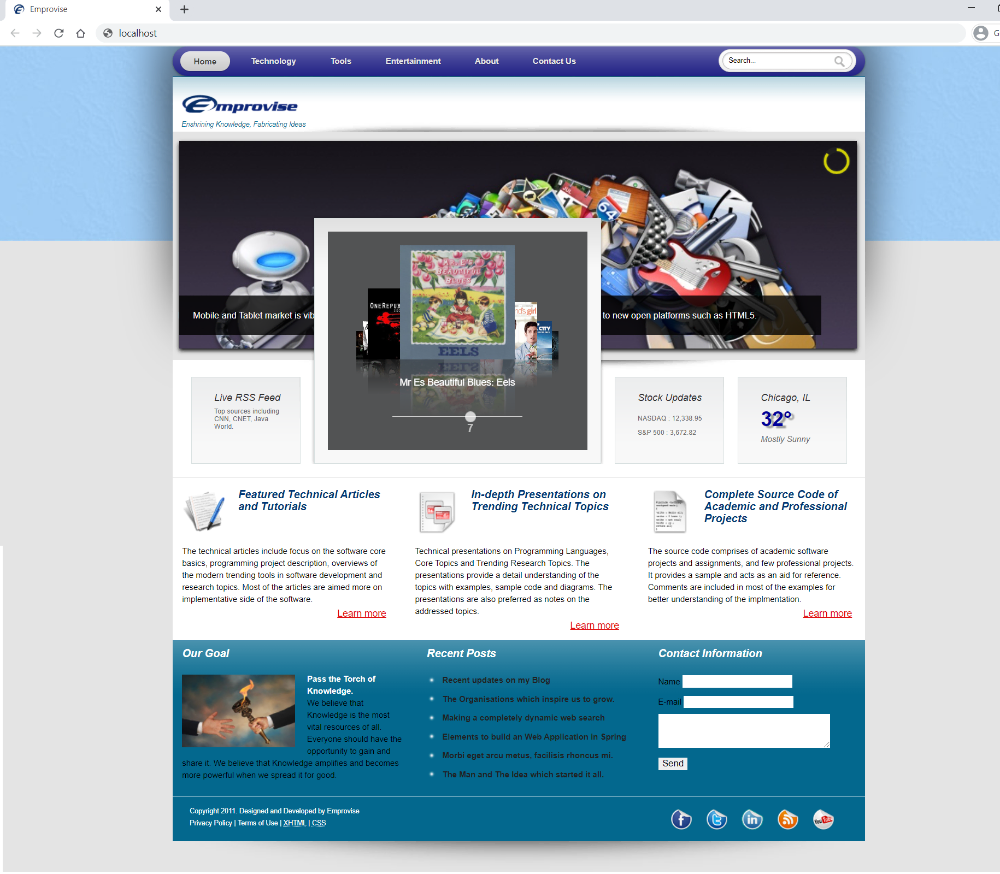
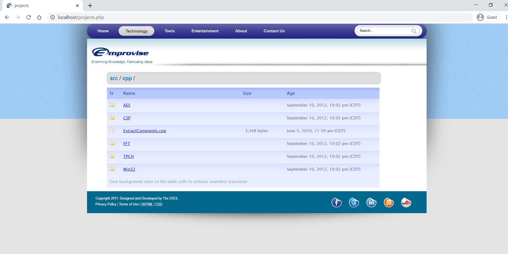
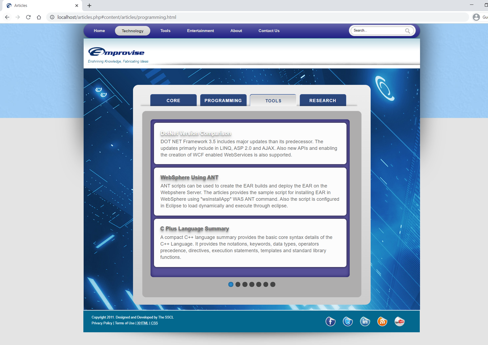
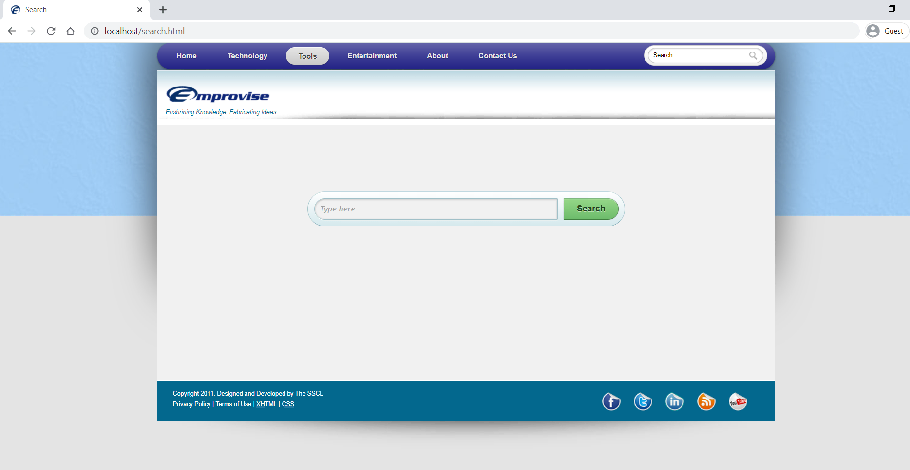
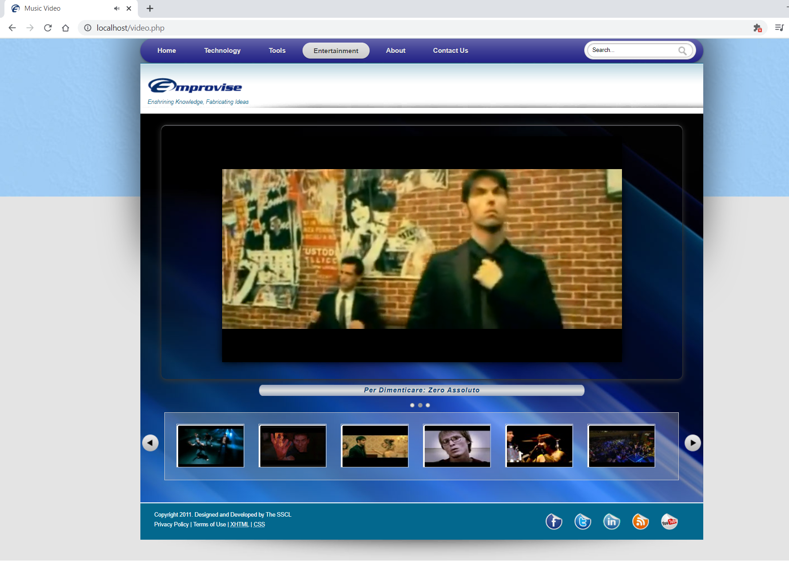

# Emprovise Website (2012)

Emprovise was a showcase website created using HTML5, JQuery and PHP in 2012. It displayed modern look and feel with animations, compatible with smartphones. Emprovise contains articles, presentations, source code, youtube videos, music, dynamic notes and indexing/search for entire site. It provides an elegant homepage with dynamic widgets depicting weather, stocks, music and tech news using RSS. All the content is presented using HTML5/CSS/JQuery pages.

## Emprovise Home

   

   

## Emprovise Projects

   

   

   

## Emprovise Articles

   

   

## Emprovise Presentations

   

   

   

## Emprovise Link Search

   

## Emprovise E-Notes

   

## Emprovise Music

   

## Emprovise Video

   

## Emprovise About Me

   

## Emprovise Contact

   

## Emprovise Search

   

## Requirements

* PHP 4.3.1 (or subsequent versions until 5.5.0)
* MySQL
* JQuery

### Installation and Running of MySQL Server

* Download latest [MySQL Installer](https://dev.mysql.com/downloads/installer/) and follow windows installation steps.
* Alternatively, can download [Latest MySQL Community Server](https://dev.mysql.com/downloads/mysql/) or [MySQL Archive Release](https://downloads.mysql.com/archives/community/) and extract the zip file. MYSQL_HOME is the path to the unzipped MySQL **mysql** directory. Set MYSQL_HOME as an environment (system) variable.
* Create a **my.cnf** file in MYSQL_HOME directory and add below contents. Create **data** and **temp** directories in MYSQL_HOME.

        [client]
        port=3306
        socket=%MYSQL_HOME%\\temp\\mysql.sock

        [mysqld]
        port=3306

        # set basedir to your installation path
        basedir=%MYSQL_HOME%

        # set datadir to the location of your data directory
        datadir=%MYSQL_HOME%\\data

        socket=%MYSQL_HOME%\\temp\\mysql.sock
        key_buffer_size=16M
        max_allowed_packet=128M

        [mysqldump]
        quick

* Initialize MySQL using the below initialize option in mysqld command. Then start the mysqld server.

        $ cd /d %MYSQL_HOME%
        $ bin\mysqld --console --initialize
        $ bin\mysqld --console

* To run MySQL on Windows as a service execute the commands in [Starting MySQL as a Windows Service](https://dev.mysql.com/doc/refman/8.0/en/windows-start-service.html).
* To update root password follow the below commands. The current root password can be found from the output of the previous **mysqld --console --initialize** command, from the line **[Server] A temporary password is generated for root@localhost: xxxxxxxx**.

        $ .\bin\mysql -u root -p xxxxxxxx

        mysql> FLUSH PRIVILEGES;
        mysql> ALTER USER 'root'@'localhost' IDENTIFIED BY 'new_password';

* Create a new database named **emprovis_root**. Then create a new user **emprovis_user** with password **user123** and grant the permissions to **emprovis_root** database using below **mysql** commands. The database credentials are stored in files `root/lib/db/connect.php` and `root/admin/sphider/settings/database.php` of the application. The FLUSH PRIVILEGES allows to save the changes and reload updated privileges.

        $ bin\mysqld --console

        mysql> CREATE DATABASE emprovis_root;
        mysql> CREATE USER 'emprovis_user'@'localhost' IDENTIFIED BY 'user123';
        mysql> GRANT ALL PRIVILEGES ON emprovis_root.* TO 'emprovis_user'@'localhost';
        mysql> FLUSH PRIVILEGES;

* MySQL runs on default port 3306 which can be changed using **my.cnf** configuration file.
* Create all the required tables from sql scripts located in `root/lib/db/table.sql` and `root/admin/sphider/sql/tables.sql`. The db scripts for sphider is used to enable search functionality.

## Setup and Configuring Apache Http Server for Windows

Download Apache HTTP Server Windows binary with version [apache_2.0.49-win32-x86-no_ssl.msi](https://archive.apache.org/dist/httpd/binaries/win32/). We can also use IIS for HTTP Server. It is recommended to accept the All Users, Port 80 option. If we want to use another port, we can set this up later, in the configuration file.
Finally, you are asked to click install. You can now find Apache, as a Windows service, in the Control Panel, under **Administrative Tools > Services**.
Configuring Apache will be analogous, whatever platform you are on. These instructions will be for a Windows environment. The only changes you will need will be to account for the different way file paths are described on Linux, Mac and Windows. On all platforms, Apache is configured by a file called httpd.conf. Open this file up in a text editor. (I often need multiple text files, so I use NoteTab in preference to NotePad. NoteTab is free, and is available from www.notetab.com. On Linux (I’m using Mandrake 9.1); I use Quanta, which also permits multiple files open.).

Find the line referring to Listen.

    Listen 80

If you are running 2 web servers, change this line to

    Listen 8080

If left at 80, you will access the web server at http://localhost. Otherwise, it will be at http://localhost:8080. Whenever you make a change to this httpd.conf file, you must restart Apache, for it to recognise the changes. Find the document root statement.

    DocumentRoot "C:/Program Files/Apache Group/Apache2/htdocs"

Check it describes the actual position of the web server root. Unix type document roots do not need to be in quotes, but Windows paths work better in quotes. Don’t ask me why! Notice also that the Windows backslashes are rendered as forward slashes. As with IIS, you could simply place your sites as subfolders of the web root. Thus, **C:\Program Files\Apache Group\Apache2\htdocs\mysite** would be served as http://localhost/mysite.
As with IIS, it is usually more convenient to have the folders elsewhere. In Apache, this is referred to as an alias. Search **httpd.conf** for the word alias. You will see a couple of aliases set by default. The script gives other examples, in the commented lines (any line beginning # is a comment line, and ignored at execution). Here is a typical alias off my machine.

    # permission for emprovise folder
    Alias /emprovise "C:/webs/emprovise"
    <Directory "C:/webs/emprovise">
    Options Indexes MultiViews
    AllowOverride None
    Order allow,deny
    Allow from all
    </Directory>

I have added a comment for each alias to make it easy to find. The Alias command defines the nature of the alias. This is saying that **C:\webs\emprovise** will be served as http://localhost/emprovise. The information in the Directory tags sets the permissions. We enter:

    # permission for phpbattybooks folder
    Alias /phpbattybooks "C:/webs/phpbattybooks"
    <Directory "C:/webs/phpbattybooks">
    Options Indexes MultiViews
    AllowOverride None
    Order allow,deny
    Allow from all
    </Directory>

As usual, after any changes, save **httpd.conf**, and restart Apache.

## Installing PHP

Download the whole PHP zipped package instead of using the Windows Installer. PHP is obtained from www.php.net, where you will find detailed instructions on installation, which is not difficult.

* Stop Apache
* [Download](https://museum.php.net/win32/) zip file **Php-4.3.1-Win32.zip**, rather than win installer.
* Extract contents to **C:\php**
* Copy **php.ini-dist** to your Windows directory – Windows in XP, WINNT in 2000. Rename it as php.ini
* Copy **php4ts.dll** from C:\php to C:\Windows\System32
* Edit **php.ini** in a text editor, as shown in the next few lines
* Find the line extension_dir = ./
* Amend to **extension_dir = "C:\php"**
* Find line **doc_root = ./**
* Amend line to **doc_root = "C:\Program Group\Apache2\htdocs"**
* Find line **session.save_path = ./tmp**
* Amend line to **session.save_path = "C:\tmp"**. Make sure that the folder **"C:\tmp"** exists, or use another folder in the **php.ini** file.
* Save and close php.ini. (Refer to the **php.ini** file in this repository)
* Open **httpd.conf** in text editor
* Look for lines beginning LoadModule. Add these lines

      LoadModule php4_module "C:/php/sapi/php4apache2.dll"
      AddType application/x-httpd-php .php

* Save file
* Start Apache

The next job is to test that php is working. Create a file in a text editor, or Dreamweaver. Fill it with this code:

      <?php
           phpinfo();
      ?>

Save the file into the root of the Apache web server, as phpinfo.php. Call the file up in your browser, e.g. as http://localhost:8080/phpinfo.php When you do this, you should see a page of information about PHP. This will show that your installation is working. If you do not get such a page, check all the steps above very carefully.

Follow the instructions in [Sphider Readme](root/admin/sphider/README.md) to enable search feature.
